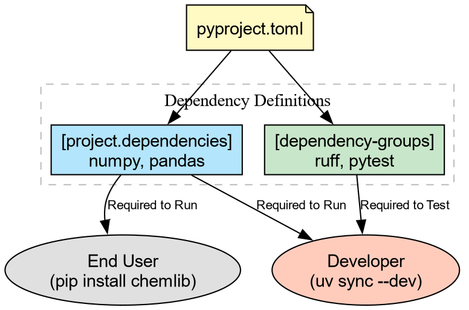
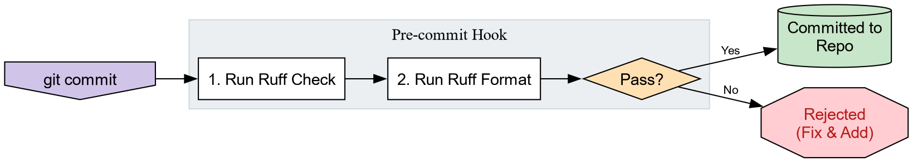

::: questions
-   How do I keep development tools separate from my library
    dependencies?
-   How can I automatically fix style errors?
-   How do I ensure my code works as expected?
-   What are pre-commit hooks?
:::

::: objectives
-   Use `uv add --dev`{.verbatim} to install tools for developers
    (linting, testing).
-   Configure `ruff`{.verbatim} to format code and catch bugs.
-   Write and run a simple test suite with `pytest`{.verbatim}.
-   Automate checks using `prek`{.verbatim}.
:::

## The "Works on My Machine" Problem (Again)

We have a `pyproject.toml`{.verbatim} that defines what our package
needs to **run** (e.g., `numpy`{.verbatim}).

But as developers, we need more tools. We need tools to:

1.  **Format** code (so it looks professional).
2.  **Lint** code (to catch bugs before running).
3.  **Test** code (to verify correctness).

We don't want to force our users to install these tools just to **use**
our library. We need **Development Dependencies**.

## Development Dependencies with `uv`

We will use `uv`{.verbatim} to add tools to a special `dev`{.verbatim}
group. This keeps them separate from the main `dependencies`{.verbatim}.

``` bash
# Add Ruff (linter), Pytest (testing), and plugins for coverage/randomization
uv add --dev ruff pytest pytest-cov pytest-randomly
```

This updates `pyproject.toml`{.verbatim}:

``` toml
[dependency-groups]
dev = [
    "pytest>=8.0.0",
    "ruff>=0.1.0",
]
```

```{=org}
#+RESULTS[2a00339aa9b4a78152f15707cdefa44dec0c5ff0]:
```


## Linting and Formatting with `ruff`

[**Ruff** is an extremely fast static analysis
tool](https://astral.sh/ruff) that replaces older tools like
`flake8`{.verbatim} (linting), `black`{.verbatim} (formatting), and
`isort`{.verbatim} (sorting imports).

Let's see how messy our code is. Open
`src/chemlib/geometry.py`{.verbatim} and make it "ugly": add some unused
imports or bad spacing.

``` python
# src/chemlib/geometry.py
import os  # Unused import!
import numpy as np

def center_of_mass(atoms):
    x = 1    # Unused variable!
    print("Calculating...")
    data = np.array(atoms)
    return np.mean(data, axis=0)
```

Now, run the linter:

``` bash
uv run ruff check
```

``` example
src/chemlib/geometry.py:2:8: F401 [*] =os= imported but unused
src/chemlib/geometry.py:6:5: F841 [*] Local variable =x= is assigned to but never used
Found 2 errors.
```

`ruff`{.verbatim} found code-smell. Now let's fix the formatting
automatically:

``` bash
uv run ruff format
```

Your code is now perfectly spaced and sorted according to community
standards.

## Testing with `pytest`{.verbatim}

Now that the code **looks** right, does it **work** right?

We need to write a test. By convention, tests live in a
`tests/`{.verbatim} directory at the root of your project.

``` bash
mkdir tests
# Create __init__.py to allow relative imports within the tests directory
touch tests/__init__.py
```

Create a test file `tests/test_geometry.py`{.verbatim}:

    import numpy as np
    import pytest
    from chemlib.geometry import center_of_mass

    def test_center_of_mass_simple():
        """Test COM of a simple diatomic molecule."""
        atoms = [[0, 0, 0], [2, 0, 0]]
        expected = [1.0, 0.0, 0.0]

        result = center_of_mass(atoms)

        # Use numpy's assertion helper for float comparisons
        np.testing.assert_allclose(result, expected)

    def test_center_of_mass_cube():
        """Test COM of a unit cube."""
        atoms = [
            [0,0,0], [1,0,0], [0,1,0], [0,0,1],
            [1,1,0], [1,0,1], [0,1,1], [1,1,1]
        ]
        expected = [0.5, 0.5, 0.5]
        result = center_of_mass(atoms)
        np.testing.assert_allclose(result, expected)

Run the tests using `uv run`{.verbatim}. We include the
`--cov`{.verbatim} flag (from `pytest-cov`{.verbatim}) to see which
lines of code our tests executed:

``` bash
uv run pytest --cov=src
```

``` example
tests/test_geometry.py ..                                            [100%]

---------- coverage: platform linux, python 3.14 ----------
Name                        Stmts   Miss  Cover
-----------------------------------------------
src/chemlib/__init__.py         0      0   100%
src/chemlib/geometry.py         4      0   100%
-----------------------------------------------
TOTAL                           4      0   100%

========================== 2 passed in 0.04s ==========================
```

### Why did this work?

Because of the **Src Layout** established earlier, `uv run`{.verbatim}
installs the package in editable mode. `pytest`{.verbatim} imports
`chemlib`{.verbatim} as if it existed as a standard installed library.

::: challenge
## Challenge: Break the Test

Modify `src/chemlib/geometry.py`{.verbatim} to introduce a bug (e.g.,
divide by `len(data) - 1`{.verbatim} instead of the true mean).

1.  Run `uv run pytest`{.verbatim}. What happens?
2.  Run `uv run ruff check`{.verbatim}. Does the linter catch this logic
    error?

::: solution
1.  **Pytest Fails:** It will show exactly where the numbers mismatch
    (`AssertionError`{.verbatim}).
2.  **Ruff Passes:** Linters check **syntax** and **style**, not
    **logic**. This is why we need both!
:::
:::

## Automating best practices

```{=org}
#+RESULTS[a21399f94d704dc996b892a1daaac953f3da96b9]:
```


We have tools, but we have to remember to run them. **pre-commit** hooks
automate this by running checks **before** you can commit code. We will
use `prek`{.verbatim}, [a Rust rewrite](https://prek.j178.dev/cli/) of
the venerable [pre-commit](https://pre-commit.com/).

First, add it to our dev tools:

``` bash
uv add --dev prek
```

Create a configuration file `.pre-commit-config.yaml`{.verbatim} in the
root directory:

    repos:
      - repo: https://github.com/astral-sh/ruff-pre-commit
        rev: v0.1.0
        hooks:
          - id: ruff
            args: [ --fix ]
          - id: ruff-format

Now, run the hook:

``` bash
uv run prek
```

.. and finally install the action as a `git`{.verbatim} hook

``` bash
uv run prek install
```

``` example
prek installed at .git/hooks/pre-commit
```

Now, try to commit messy code. `git`{.verbatim} will stop you, run
`ruff`{.verbatim}, fix the file, and ask you to stage the clean file.
You can no longer commit ugly code by accident!

::: keypoints
-   **Development Dependencies** (`uv add --dev`{.verbatim}) keep tools
    like linters separate from library requirements.
-   **Ruff** is the modern standard for fast Python linting and
    formatting.
-   **Pytest** verifies code correctness; **Src Layout** makes test
    discovery reliable.
-   **Pre-commit** hooks ensure no bad code ever enters your version
    control history.
:::
